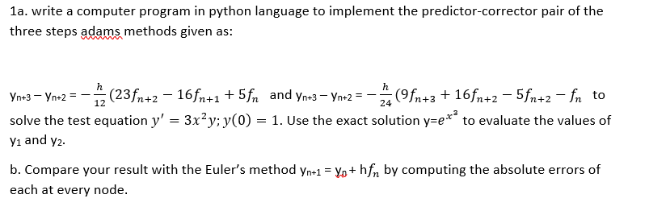

# Numerical Methods for Differential Equations

This repository contains Python implementations of numerical methods for solving differential equations. The code includes:

1. **Predictor-Corrector Methods**:
   - Implementation of Adams-Bashforth-Moulton predictor-corrector pairs.
   - Solutions for initial value problems (IVPs) using step sizes `h = 0.001` and `h = 0.0001`.

2. **Comparison with Theoretical Solutions**:
   - Numerical results are compared with the exact solution to compute absolute errors.

3. **Runge-Kutta 4th Order Method**:
   - Used to compute initial values for the predictor-corrector methods.

## 📂 Repository Structure

- **`adams_predictor_corrector.py`**: Implements the Adams predictor-corrector method for solving IVPs.
- **`runge_kutta_4th_order.py`**: Implements the 4th-order Runge-Kutta method for computing initial values.
- **`README.md`**: This file, providing an overview of the project and instructions.

## 🛠️ Installation

### Step 1: Install Python
If you don't have Python installed, follow these steps:

1. **Download Python**:
   - Visit the official Python website: [python.org](https://www.python.org/).
   - Download the latest version of Python (3.x recommended).

2. **Install Python**:
   - Run the installer and make sure to check the box that says **"Add Python to PATH"**.
   - Follow the installation instructions.

3. **Verify Installation**:
   - Open a terminal or command prompt and type:
     ```bash
     python --version
     ```
   - You should see the Python version displayed (e.g., `Python 3.12.0`).

### Step 2: Install Required Libraries
This project uses the following Python libraries:
- **NumPy**: For numerical computations.

To install the required libraries, run the following command in your terminal or command prompt:
```bash
pip install numpy

Install tabulate - "pip install tabulate"
 


Step 3: Clone the Repository
To get the code, clone this repository to your local machine:
git clone https://github.com/your-username/numerical-methods.git
cd numerical-methods

Running the Code
Run the Adams Predictor-Corrector Method:

Open a terminal or command prompt in the project directory.

Run the following command:
python adams_predictor_corrector.py
The program will output the numerical results, exact solution, and errors for step sizes h = 0.001 and h = 0.0001.

Run the Runge-Kutta 4th Order Method:

Run the following command:
python runge_kutta_4th_order.py
The program will output the results of the Runge-Kutta method.

📊 Results
The numerical solutions are compared with the theoretical solution 
y = e − x 2 y=e  −x 2 at every node. The absolute errors are computed to evaluate the accuracy of the methods.

⭐ Give the Repository a Star
If you find this project useful or interesting, please consider giving it a ⭐ star on GitHub! Your support helps motivate further development and improvements.

📝 License
This project is licensed under the MIT License. See the LICENSE file for details.

📧 Contact
For questions or feedback, feel free to reach out:

Email: ezirimchukwuebuka24@gmail.com

GitHub: kingzykesh